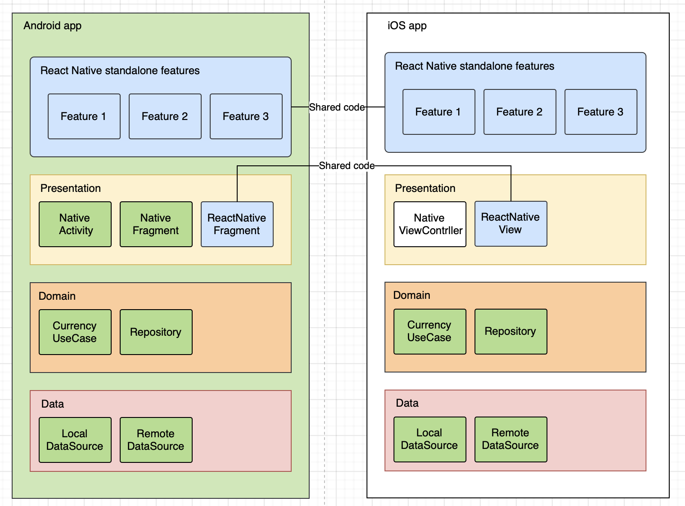
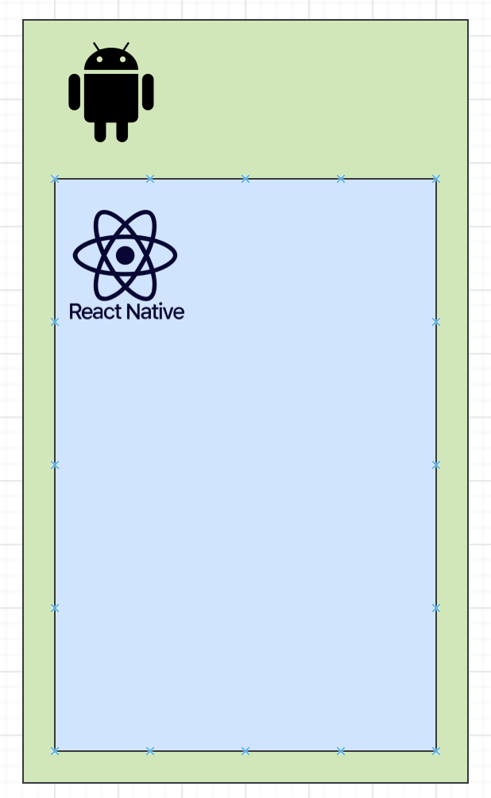
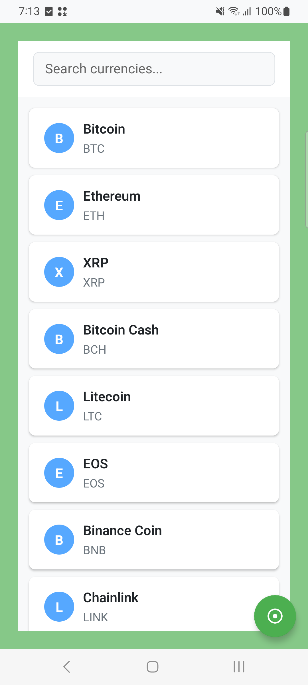
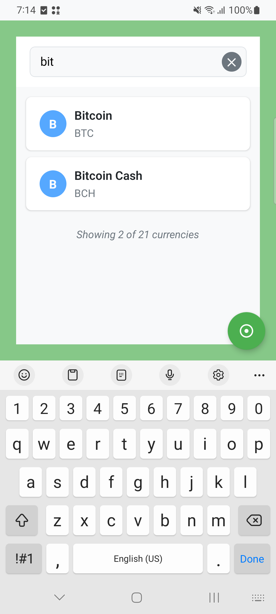
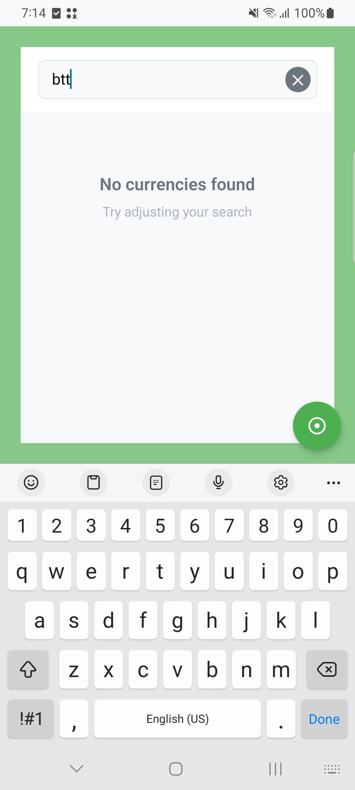

# Currency Demo App

## Installation & Setup

### Development Environment

- **Node.js**: v18.19.0
- **Yarn**: 1.22.22
- **React Native**: 0.79.2
- **Android Studio**: Android Studio Meerkat | 2024.3.1 Patch 1
- **JDK**: OpenJDK 17.0.4
- **Gradle**: 8.10.2

### Project Setup

1. **Clone Repository**

```bash
git clone <repository-url>
cd CurrencyDemoApp
```

2. **Install Dependencies**

```bash
yarn
```

3. **Run Application**

```bash
yarn run android
```

4. **Run Test**

```bash
# for react-native
yarn test

# for android native
cd android/
./gradlew :app:testDebugUnitTest
```

## Requirements Checklist

### ✅ Technical Requirements

- [x] **Kotlin (native)**: Android native implemented in Kotlin
- [x] **React Native**: UI of List and Search implemented in React Native with TypeScript
- [x] **Google Recommended Architecture**: Clean Architecture
- [x] **Dependency Injection**: Implemented for data sources, repository, use-cases, viewModel, etc.
- [x] **Unit Testing**: Comprehensive tests without external mocking frameworks

### ✅ Functional Requirements

#### Core Functionality

- [x] **CurrencyListFragment**: Reusable React Native screen and used as native fragment in android
- [x] **DemoActivity**: Showcase activity with required functionality

#### Five Required Buttons

1. [x] **Clear Data**: Button to clear local database
2. [x] **Insert Data**: Button to populate local database
3. [x] **Currency List A**: Display Crypto currencies
4. [x] **Currency List B**: Display Fiat currencies
5. [x] **Display All**: Show all purchasable currencies from both lists

#### Additional Features

- [x] **Search Feature**: Implemented with multiple search strategies
- [x] **Search Cancellation**: Clear button and proper state management
- [x] **Empty View**: Proper empty state handling
- [x] **Background Operations**: All IO operations off UI thread using coroutines

### ✅ UI/UX Enhancements

- [x] **Responsive Design**: Portrait and landscape layouts
- [x] **Visual Feedback**: Loading states and user feedback
- [x] **Search Optimization**: Debounced search for performance
- [x] **Accessibility**: Proper content descriptions and labels

## App Architecture Design Approach

### Native-First Approach with React Native Integration

In this demo, instead of develop demo-app completely in either native or react-native, the development approach **simulates a real-world scenario similar to **Crypto.com\***\*, where the majority of features and business logic are implemented natively for performance, security, and reliability. The goal is to leverage **React Native\*\* selectively to accelerate development and enhance productivity for specific features, such as the currency list and search UI.

{ width="100%" }

#### Use Case Simulation

- **Core Modules**: The foundational `data/` and `domain/` modules are fully developed in native Android (Kotlin). These modules handle all business logic, data management, and domain rules, ensuring robust and optimized performance.
- **Feature Integration**: For the currency list and search functionality, React Native is integrated on top of the existing native modules. This allows rapid UI development and iteration without rewriting core logic.
- **Reuse of Native Logic**: The React Native layer communicates with the native modules via a custom bridge, reusing the already-developed repository and use-case logic for data retrieval, search, and concurrency management.
- **Seamless User Experience**: The integration is designed so that users experience a seamless interface, with React Native components embedded as fragments within native activities.

#### Benefits of This Approach

- **Maximized Productivity**: React Native accelerates feature delivery for UI-heavy or frequently changing screens.
- **Native Performance**: Critical business logic and data operations remain in the native layer, ensuring optimal performance and security.
- **Code Reuse**: Existing native modules are reused, reducing duplication and maintenance overhead.
- **Scalability**: This hybrid approach allows teams to incrementally adopt React Native where it adds the most value, without compromising the stability of the core app.

This demo app showcases how React Native can be strategically integrated into a native Android codebase, like the sketch below:
{ width="33%" }

#### Component Breakdown

##### 1. Native Android Layer

- **DemoActivity**: Showcase activity with 5 functional buttons
- **CurrencyBridgeModule**: Bridge for React Native communication
- **Domain Layer**: Use case logics and Clean data access abstraction
- **Data Sources**: Local and remote data management

##### 2. React Native Layer

- **CurrencyScreen**: Main UI component with search functionality
- **useCurrencyData**: Custom hook for currency data management
- **SearchStrategy Pattern**: Flexible search implementation
  - `NameStartsWithSearchStrategy`
  - `SpacePrefixedSearchStrategy`
  - `SymbolStartsWithSearchStrategy`
  - `CompositeSearchStrategy`

## Screenshot

{ width="33%" }{ width="33%" }{ width="33%" }

## Repository Structure

```
CurrencyDemoApp/
├── android/                          # Native Android code
│   └── app/src/main/java/            # Main Android source
│       └── com/currencydemoapp/      # Package structure
│           ├── data/                 # Data layer
│           ├── domain/               # Domain layer
│           └── presentation/         # Presentation layer
├── src/                              # React Native source
│   ├── components/                   # UI components
│   ├── hooks/                        # Custom hooks
│   ├── types/                        # TypeScript types
│   └── utils/                        # Utility functions
└── tests/                            # Unit tests
```
